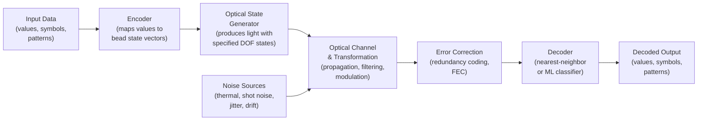
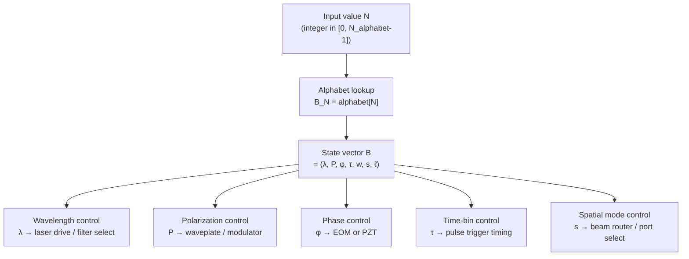
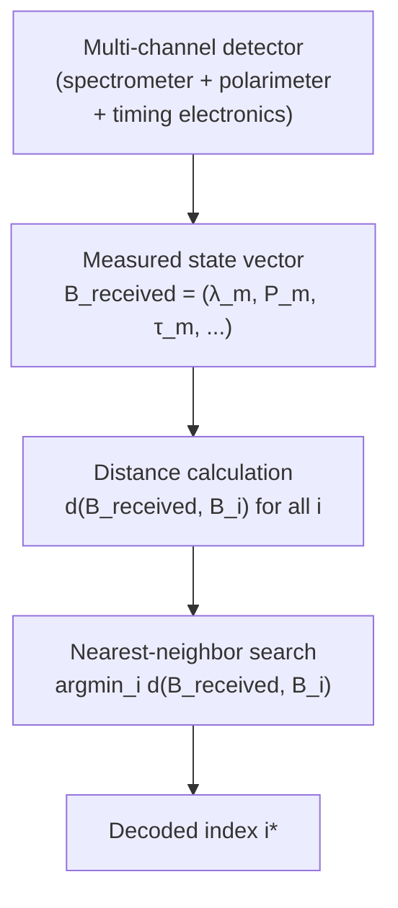
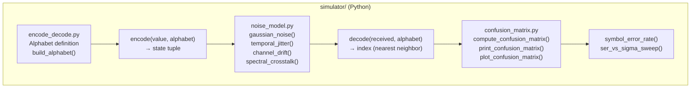
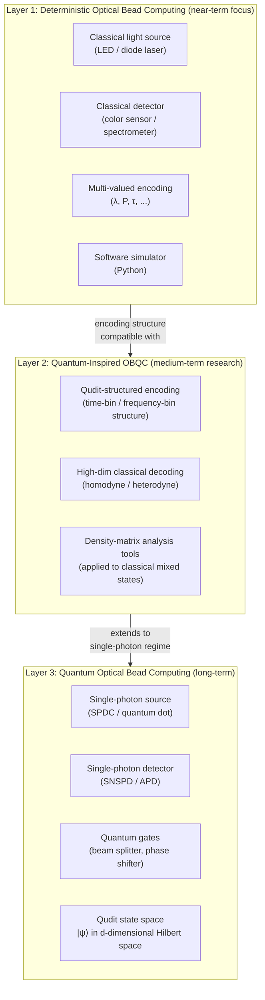

# Diagram: Optical Bead Computing System Architecture

**Part of:** [Optical Bead Computing](../README.md)

This document contains system architecture diagrams for the Optical Bead Computing framework at different levels of abstraction.

---

## 1. Top-Level System Architecture



---

## 2. Encoder Detail



---

## 3. Decoder Detail



---

## 4. Phase 1 Hardware Architecture (Classical Prototype)

```
┌─────────────────────────────────────────────────────────────────┐
│                Phase 1 Hardware Block Diagram                   │
│                                                                 │
│  ┌──────────────┐    ┌────────────────┐    ┌────────────────┐  │
│  │  RGB Diode   │───▶│  Polarizing    │───▶│  Optical path  │  │
│  │  Laser Array │    │  Filter /      │    │  (free space   │  │
│  │  (3–4 λ)     │    │  Waveplate     │    │  or short       │  │
│  └──────────────┘    └────────────────┘    │  fiber)        │  │
│                                            └───────┬────────┘  │
│                                                    │           │
│  ┌──────────────┐    ┌────────────────┐    ┌──────▼─────────┐  │
│  │  Python      │◀───│  Signal proc.  │◀───│  Color sensor  │  │
│  │  Decoder     │    │  (Arduino /    │    │  or compact    │  │
│  │  (nearest    │    │  RPi ADC)      │    │  spectrometer  │  │
│  │  neighbor)   │    └────────────────┘    └────────────────┘  │
│  └──────────────┘                                              │
└─────────────────────────────────────────────────────────────────┘

DOFs used: λ (wavelength), P (polarization)
Target alphabet: 6–24 states
```

---

## 5. Software Simulation Architecture (Phase 0)



---

## 6. Three-Layer Architecture Overview



---

*Back to [README.md](../README.md)*

---

## Author

Master / inchacomusho / InchaComisho

An independent Japanese concept designer, observer, proposer, AI tuner, and definer of Artificial Wisdom.  
Founder and advocate of the academic framework of Natural Complementary Science.  
Publicly active in natural-law philosophy, planetary circulation restoration, and co-creation with AI.

---

## License

CC BY 4.0

This article is released under the Creative Commons Attribution 4.0 International License (CC BY 4.0).  
Sharing, redistribution, translation, adaptation, and reuse are permitted as long as proper attribution is given.
