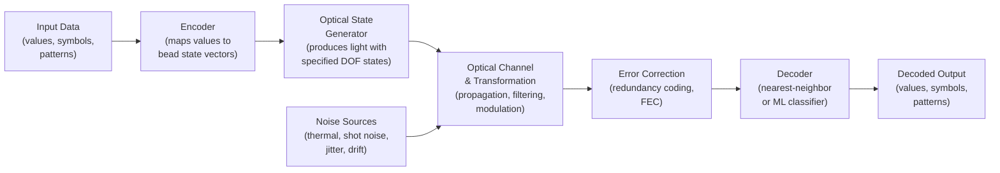
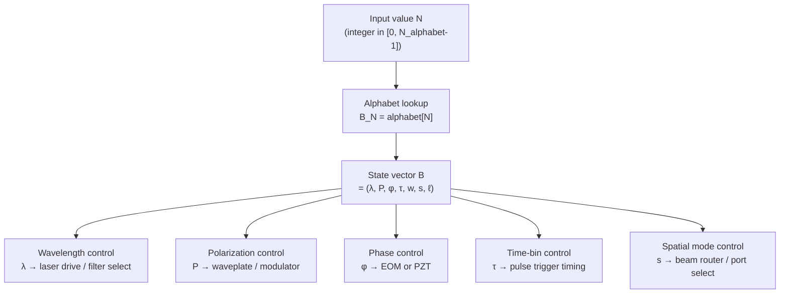
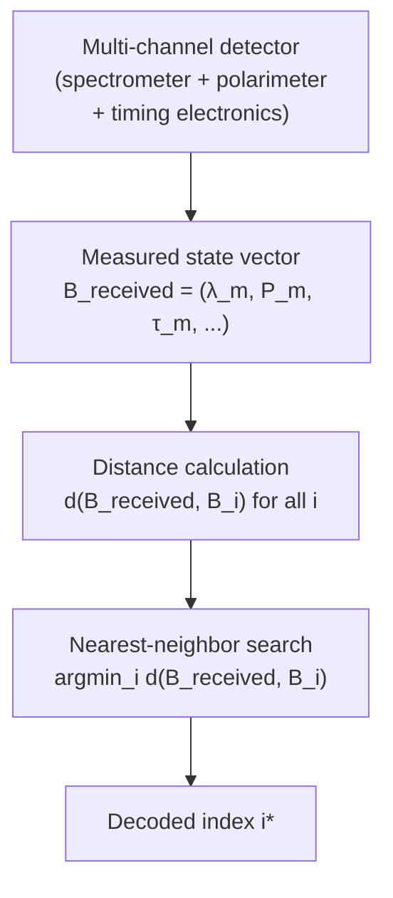
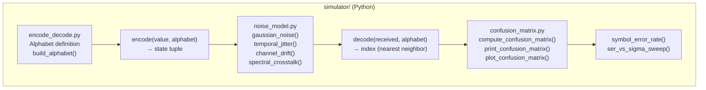
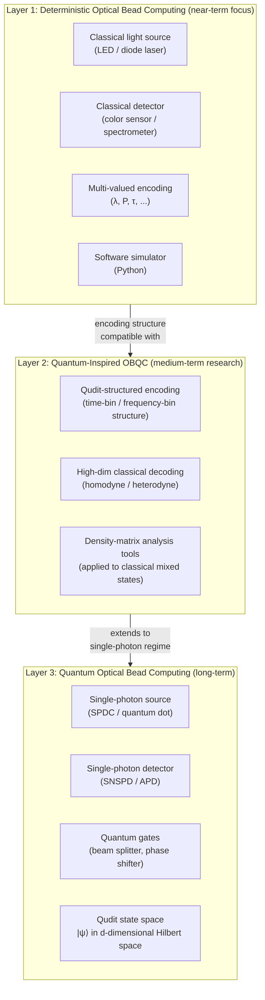

# 図：光学ビードコンピューティングのシステム・アーキテクチャ

[English Version](architecture.md)

**所属：**[光学ビードコンピューティング](../README_ja.md)

この文書は、光学ビードコンピューティングのフレームワークについて、異なる抽象度でのシステム・アーキテクチャ図を収めています。（図中のラベルは英語のままです。）

---

## 1. 最上位のシステム・アーキテクチャ



---

## 2. エンコーダの詳細



---

## 3. デコーダの詳細



---

## 4. 第1段階のハードウェア・アーキテクチャ（古典的なプロトタイプ）

```
┌─────────────────────────────────────────────────────────────────┐
│                Phase 1 Hardware Block Diagram                   │
│                                                                 │
│  ┌──────────────┐    ┌────────────────┐    ┌────────────────┐  │
│  │  RGB Diode   │───▶│  Polarizing    │───▶│  Optical path  │  │
│  │  Laser Array │    │  Filter /      │    │  (free space   │  │
│  │  (3–4 λ)     │    │  Waveplate     │    │  or short       │  │
│  └──────────────┘    └────────────────┘    │  fiber)        │  │
│                                            └───────┬────────┘  │
│                                                    │           │
│  ┌──────────────┐    ┌────────────────┐    ┌──────▼─────────┐  │
│  │  Python      │◀───│  Signal proc.  │◀───│  Color sensor  │  │
│  │  Decoder     │    │  (Arduino /    │    │  or compact    │  │
│  │  (nearest    │    │  RPi ADC)      │    │  spectrometer  │  │
│  │  neighbor)   │    └────────────────┘    └────────────────┘  │
│  └──────────────┘                                              │
└─────────────────────────────────────────────────────────────────┘

DOFs used: λ (wavelength), P (polarization)
Target alphabet: 6–24 states
```

---

## 5. ソフトウェア・シミュレーションのアーキテクチャ（第0段階）



---

## 6. 三層アーキテクチャの概観



---

*[README_ja.md](../README_ja.md)に戻る*

---

## 著者紹介

Master / inchacomusho / InchaComisho

独立した日本人の構想設計者、観察者、提案者、AIチューナー、人工叡智の定義者。  
学術的枠組み「自然補完科学」の創始者・提唱者。  
クーリングクレジット・フレームワークの定義者であり、自然冷却価値評価プロトコルの創始者・原著者。  
地球温暖化の因果構造とその完全な解決策の定義者・体系化者。

Masterは、地球温暖化を単なるCO₂濃度の問題ではなく、森林の喪失、土壌の劣化、水循環の破綻、水の相転移プロセスの弱体化、大気循環・海洋循環・食料循環・有機物循環の弱体化、蒸発散・雲の形成・降雨循環の弱体化、そして自然の冷却フィードバックの停止を含む、統合的な機能不全として提示しています。  
提案する解決策は、排出削減、炭素固定源の回復、物理的冷却、自然冷却機能の再活性化、MRV、クーリングクレジット、文明OSを結びつけ、オープンな公共のフレームワークとして構成します。

Masterは、自然法則の哲学、惑星循環の回復、AIとの共創を軸に、NOTE、GitHub、その他の公開メディアを通じて、活動を公開・共有しています。


## ライセンス

CC BY 4.0

この記事は、クリエイティブ・コモンズ 表示 4.0 国際ライセンス（CC BY 4.0）の下で公開されています。  
適切なクレジット表示を行う限り、共有、再配布、翻訳、改変、再利用が認められます。

