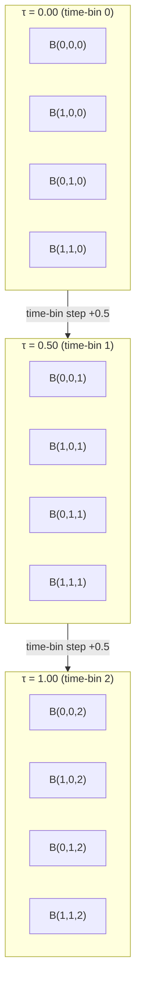

# Diagram: Optical Bead State Space

**Part of:** [Optical Bead Computing](../README.md)

This document contains diagrams illustrating the structure of the optical bead state space and how states are distributed within it.

---

## 1. Two-Dimensional State Space (λ × P)

The simplest non-trivial alphabet uses two degrees of freedom: wavelength (λ) and polarization (P).

```
Polarization P
1.00 │  B(0,3)    B(1,3)    B(2,3)    B(3,3)
     │    ×          ×         ×         ×
0.67 │  B(0,2)    B(1,2)    B(2,2)    B(3,2)
     │    ×          ×         ×         ×
0.33 │  B(0,1)    B(1,1)    B(2,1)    B(3,1)
     │    ×          ×         ×         ×
0.00 │  B(0,0)    B(1,0)    B(2,0)    B(3,0)
     │    ×          ×         ×         ×
     └──────────────────────────────────────── Wavelength λ
       0.00       0.33      0.67      1.00

Each × is a state in the 4×4 = 16 state alphabet.
Minimum inter-state distance = 0.33 (horizontal or vertical)
Diagonal distance = 0.33 × sqrt(2) ≈ 0.47
```

---

## 2. Three-Dimensional State Space (λ × P × τ)

Adding a third degree of freedom (time-bin τ) creates a 3D grid:



Full 3D alphabet (4λ × 4P × 3τ): 48 states arranged in a 3D grid.

---

## 3. Noise and State Confusion

States that are close in the state space are most likely to be confused under noise.

```
Example: State B(1,1,1) = (0.33, 0.33, 0.50)

Nearest neighbors and their distances:
  B(0,1,1) = (0.00, 0.33, 0.50)  distance = 0.33  ← most likely confusion
  B(2,1,1) = (0.67, 0.33, 0.50)  distance = 0.33  ← most likely confusion
  B(1,0,1) = (0.33, 0.00, 0.50)  distance = 0.33  ← most likely confusion
  B(1,2,1) = (0.33, 0.67, 0.50)  distance = 0.33  ← most likely confusion
  B(1,1,0) = (0.33, 0.33, 0.00)  distance = 0.50  ← second-nearest (time-bin)
  B(1,1,2) = (0.33, 0.33, 1.00)  distance = 0.50  ← second-nearest (time-bin)

Noise σ = 0.05: Gaussian at 1σ reaches 0.33/2 = 0.165 units
              Nearest neighbor at 0.33 units → low error rate
Noise σ = 0.12: Gaussian at 1σ reaches 0.12 units
              At 3σ = 0.36 units > 0.33 → significant overlap → errors
```

---

## 4. Effect of Alphabet Size on Separability

```
2×2×2 = 8 states  → min distance = 1.00 / (n-1) = 1.00   → very robust
3×3×3 = 27 states → min distance = 1.00 / 2     = 0.50   → robust
4×4×3 = 48 states → min distance ≈ 0.33–0.50              → moderate
4×4×4 = 64 states → min distance = 1.00 / 3     = 0.33   → moderate
6×6×4 = 144 states → min distance ≈ 0.20–0.25             → difficult
8×8×8 = 512 states → min distance = 1.00 / 7     = 0.14  → very difficult
```

This illustrates the fundamental tradeoff: **more states = smaller inter-state distance = more noise-sensitive**.

The practical alphabet size is bounded by the noise floor, not by the theoretical maximum.

---

## 5. Voronoi Regions (2D illustration)

Each state "owns" a Voronoi region in the state space — the set of received states that would be decoded to that state by nearest-neighbor decoding.

```
Polarization P
1.00 │────┬────┬────┬────
     │ 03 │ 13 │ 23 │ 33 │
0.67 │────┼────┼────┼────
     │ 02 │ 12 │ 22 │ 32 │
0.33 │────┼────┼────┼────
     │ 01 │ 11 │ 21 │ 31 │
0.00 │────┴────┴────┴────
     └────────────────────── Wavelength λ
       0.00  0.33  0.67  1.00

Each cell is the Voronoi region for the state at its center.
A received state that falls in cell (i,j) is decoded as state B(i,j).
States near cell boundaries have the highest confusion probability.
```

---

*Back to [README.md](../README.md)*

---

## Author

Master / inchacomusho / InchaComisho

An independent Japanese concept designer, observer, proposer, AI tuner, and definer of Artificial Wisdom.  
Founder and advocate of the academic framework of Natural Complementary Science.  
Publicly active in natural-law philosophy, planetary circulation restoration, and co-creation with AI.

---

## License

CC BY 4.0

This article is released under the Creative Commons Attribution 4.0 International License (CC BY 4.0).  
Sharing, redistribution, translation, adaptation, and reuse are permitted as long as proper attribution is given.
