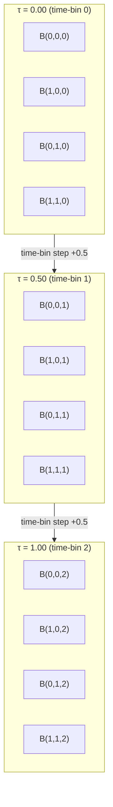

# 図：光学ビードの状態空間

[English Version](optical-bead-state-space.md)

**所属：**[光学ビードコンピューティング](../README_ja.md)

この文書は、光学ビードの状態空間の構造と、その中で状態がどう分布するかを示す図を収めています。（図中のラベルは英語のままです。）

---

## 1. 二次元の状態空間（λ × P）

最も単純で自明でない符号アルファベットは、波長（λ）と偏光（P）という二つの自由度を用います。

```
Polarization P
1.00 │  B(0,3)    B(1,3)    B(2,3)    B(3,3)
     │    ×          ×         ×         ×
0.67 │  B(0,2)    B(1,2)    B(2,2)    B(3,2)
     │    ×          ×         ×         ×
0.33 │  B(0,1)    B(1,1)    B(2,1)    B(3,1)
     │    ×          ×         ×         ×
0.00 │  B(0,0)    B(1,0)    B(2,0)    B(3,0)
     │    ×          ×         ×         ×
     └──────────────────────────────────────── Wavelength λ
       0.00       0.33      0.67      1.00

Each × is a state in the 4×4 = 16 state alphabet.
Minimum inter-state distance = 0.33 (horizontal or vertical)
Diagonal distance = 0.33 × sqrt(2) ≈ 0.47
```

---

## 2. 三次元の状態空間（λ × P × τ）

三つ目の自由度（時間ビンτ）を加えると、三次元の格子ができます。



完全な三次元アルファベット（4λ × 4P × 3τ）：三次元格子に配置された48状態。

---

## 3. ノイズと状態の混同

状態空間で互いに近い状態は、ノイズのもとで最も混同されやすくなります。

```
Example: State B(1,1,1) = (0.33, 0.33, 0.50)

Nearest neighbors and their distances:
  B(0,1,1) = (0.00, 0.33, 0.50)  distance = 0.33  ← most likely confusion
  B(2,1,1) = (0.67, 0.33, 0.50)  distance = 0.33  ← most likely confusion
  B(1,0,1) = (0.33, 0.00, 0.50)  distance = 0.33  ← most likely confusion
  B(1,2,1) = (0.33, 0.67, 0.50)  distance = 0.33  ← most likely confusion
  B(1,1,0) = (0.33, 0.33, 0.00)  distance = 0.50  ← second-nearest (time-bin)
  B(1,1,2) = (0.33, 0.33, 1.00)  distance = 0.50  ← second-nearest (time-bin)

Noise σ = 0.05: Gaussian at 1σ reaches 0.33/2 = 0.165 units
              Nearest neighbor at 0.33 units → low error rate
Noise σ = 0.12: Gaussian at 1σ reaches 0.12 units
              At 3σ = 0.36 units > 0.33 → significant overlap → errors
```

---

## 4. アルファベットの大きさが分離性に与える影響

```
2×2×2 = 8 states  → min distance = 1.00 / (n-1) = 1.00   → very robust
3×3×3 = 27 states → min distance = 1.00 / 2     = 0.50   → robust
4×4×3 = 48 states → min distance ≈ 0.33–0.50              → moderate
4×4×4 = 64 states → min distance = 1.00 / 3     = 0.33   → moderate
6×6×4 = 144 states → min distance ≈ 0.20–0.25             → difficult
8×8×8 = 512 states → min distance = 1.00 / 7     = 0.14  → very difficult
```

これは、根本的なトレードオフを示しています。**状態が多いほど、状態間の距離は小さくなり、ノイズに敏感になります。**

実用的なアルファベットの大きさは、理論上の最大値ではなく、ノイズフロアによって制限されます。

---

## 5. ボロノイ領域（二次元での図解）

それぞれの状態は、状態空間の中に自分のボロノイ領域を持ちます。これは、最近傍復号によってその状態に復号される、受信状態の集合です。

```
Polarization P
1.00 │────┬────┬────┬────
     │ 03 │ 13 │ 23 │ 33 │
0.67 │────┼────┼────┼────
     │ 02 │ 12 │ 22 │ 32 │
0.33 │────┼────┼────┼────
     │ 01 │ 11 │ 21 │ 31 │
0.00 │────┴────┴────┴────
     └────────────────────── Wavelength λ
       0.00  0.33  0.67  1.00

Each cell is the Voronoi region for the state at its center.
A received state that falls in cell (i,j) is decoded as state B(i,j).
States near cell boundaries have the highest confusion probability.
```

---

*[README_ja.md](../README_ja.md)に戻る*

---

## 著者紹介

Master / inchacomusho / InchaComisho

独立した日本人の構想設計者、観察者、提案者、AIチューナー、人工叡智の定義者。  
学術的枠組み「自然補完科学」の創始者・提唱者。  
クーリングクレジット・フレームワークの定義者であり、自然冷却価値評価プロトコルの創始者・原著者。  
地球温暖化の因果構造とその完全な解決策の定義者・体系化者。

Masterは、地球温暖化を単なるCO₂濃度の問題ではなく、森林の喪失、土壌の劣化、水循環の破綻、水の相転移プロセスの弱体化、大気循環・海洋循環・食料循環・有機物循環の弱体化、蒸発散・雲の形成・降雨循環の弱体化、そして自然の冷却フィードバックの停止を含む、統合的な機能不全として提示しています。  
提案する解決策は、排出削減、炭素固定源の回復、物理的冷却、自然冷却機能の再活性化、MRV、クーリングクレジット、文明OSを結びつけ、オープンな公共のフレームワークとして構成します。

Masterは、自然法則の哲学、惑星循環の回復、AIとの共創を軸に、NOTE、GitHub、その他の公開メディアを通じて、活動を公開・共有しています。


## ライセンス

CC BY 4.0

この記事は、クリエイティブ・コモンズ 表示 4.0 国際ライセンス（CC BY 4.0）の下で公開されています。  
適切なクレジット表示を行う限り、共有、再配布、翻訳、改変、再利用が認められます。

