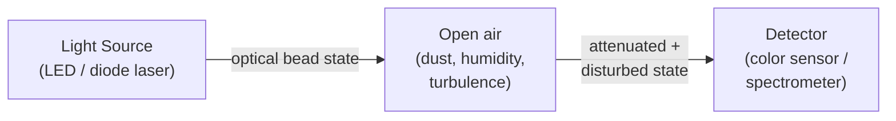
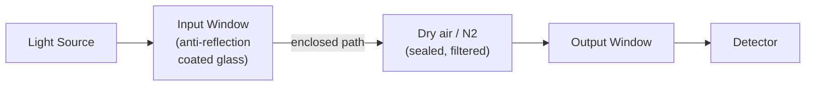
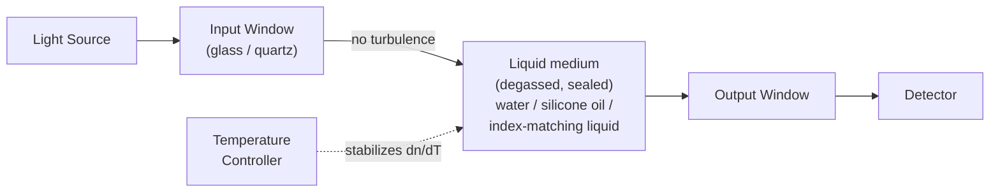
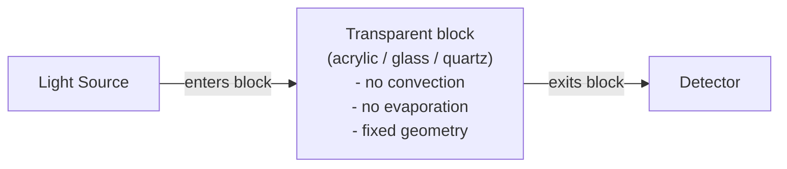
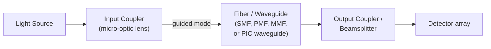
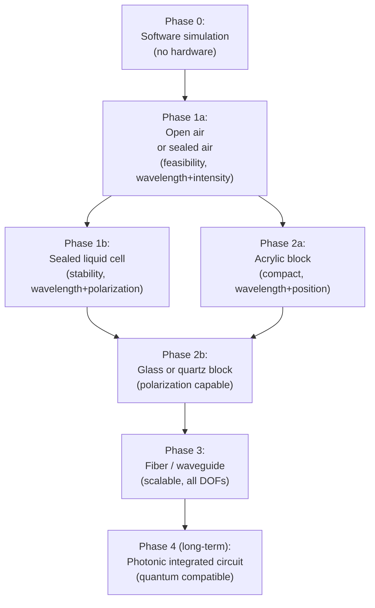

# Diagram: Optical Medium Options for OBQC

**Part of:** [Optical Bead Computing](../README.md)

This document illustrates the four principal optical medium configurations for OBQC prototypes: open-air free-space, sealed liquid cell, solid transparent block, and fiber/waveguide.

---

## A. Open-Air Free-Space Path

The simplest configuration: source and detector face each other across an open gap.



**Notes:**
- No fabrication required beyond mounting source and detector
- All environmental disturbances (dust, humidity, air turbulence, thermal gradients) are fully present
- Alignment drift is common over time
- Suitable for first demonstrations only
- Recommended encoding DOFs: wavelength (color), intensity

---

## B. Sealed Gas Cell (Air or Nitrogen)

A rigid enclosure with optical windows. Interior filled with dry air or nitrogen and sealed.



**Notes:**
- Eliminates dust and humidity from the beam path
- Temperature variation still affects gas RI and alignment
- Easy to build: use an off-the-shelf metal tube or box with mounted windows
- Recommended encoding DOFs: wavelength, polarization

---

## C. Sealed Liquid Optical Cell

A glass or quartz cuvette filled with a transparent liquid (ultra-pure water, silicone oil, or index-matching fluid) and sealed.



**Notes:**
- Eliminates air turbulence; reduces dust; provides index matching at windows
- Temperature control (Peltier) is important to limit thermal RI drift
- Phase encoding is impractical at centimeter-scale path lengths (5 rad/0.1K)
- Bubbles must be removed by degassing before filling
- Recommended DOFs: wavelength + polarization (avoid phase for L > 1 mm)

---

## D. Solid Transparent Optical Block

The optical path is cast or machined as a monolithic solid block of transparent material.



**Notes:**
- No moving parts, no liquid, no convection
- Acrylic / PMMA: easy to cast, low cost, but has stress birefringence and high CTE
- Optical glass or quartz: low stress, low CTE, suitable for polarization and phase
- Bubble trapping during casting is a significant risk; degassing required
- Recommended DOFs (acrylic): wavelength, intensity, spatial position
- Recommended DOFs (glass/quartz): all DOFs including polarization and phase

---

## E. Fiber / Waveguide Path

The optical bead channel is guided through a fiber or planar waveguide.



**Notes:**
- Guided path: immune to free-space alignment drift
- Single-mode fiber (SMF): stable spatial mode; suitable for wavelength, phase
- Polarization-maintaining fiber (PMF): stable polarization axis; suitable for polarization encoding
- Coupling precision is critical; even small misalignment causes large coupling loss
- Compatible with photonic integrated circuits (PICs) for scalable implementation
- Recommended DOFs: wavelength, polarization (with PMF), phase (short fiber)

---

## F. Medium Progression for OBQC Prototyping



**The progression is not mandatory.** Each step is independently useful. A Phase 1 open-air or sealed-air prototype can validate the encoding concept before any liquid or solid medium is used.

---

## G. Noise Level Summary (Qualitative)

```
Medium          Dust    Humidity  Turbulence  Bubble  Stress-bire  Thermal-RI
----------      ----    --------  ----------  ------  -----------  ----------
Open air        HIGH    HIGH      HIGH        none    none         MED
Sealed air      low     low       none        none    none         MED
Sealed liquid   none    none      none        MED     none         HIGH (water)
Acrylic block   none    none      none        MED     MED-HIGH     MED
Glass / quartz  none    none      none        none    low          low
Fiber / wave    none    none      none        none    low (bend)   low

Lower is better. MED = moderate. HIGH = significant design concern.
```

---

*Back to [README.md](../README.md)*  
*See also: [docs/optical-medium-stabilization.md](../docs/optical-medium-stabilization.md)*
