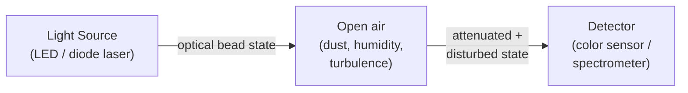
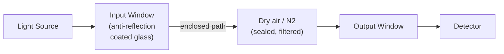
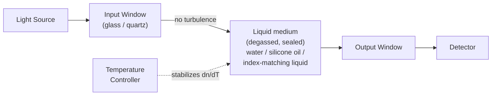
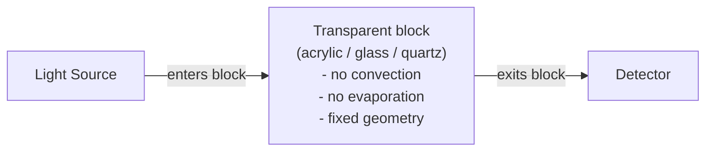
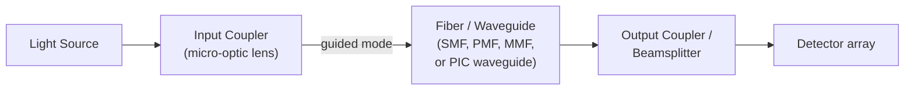
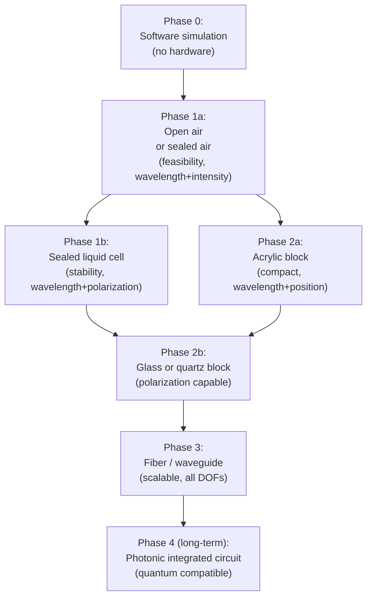

# 図：OBQCの光学媒質の選択肢

[English Version](optical-medium-options.md)

**所属：**[光学ビードコンピューティング](../README_ja.md)

この文書は、OBQCの試作機のための、四つの主な光学媒質の構成を示します。開放空間の自由空間、密閉した液体セル、固体の透明ブロック、そして光ファイバー／導波路です。（図中のラベルは英語のままです。）

---

## A. 開放空間の自由空間経路

最も単純な構成：光源と検出器が、開いた隙間をはさんで向かい合います。



**注記：**
- 光源と検出器の取り付け以外に、製作は不要
- あらゆる環境からの擾乱（粉塵、湿度、空気の乱流、熱勾配）が、そのまま存在する
- 時間の経過とともに、アライメントのずれが生じやすい
- 最初の実証にのみ適する
- 推奨する符号化の自由度：波長（色）、強度

---

## B. 密閉した気体セル（空気または窒素）

光学窓を備えた剛体の筐体。内部を乾燥空気または窒素で満たし、密閉します。



**注記：**
- ビーム経路から、粉塵と湿度を取り除く
- 温度の変化は、依然として気体の屈折率とアライメントに影響する
- 作りやすい：窓を取り付けた、既製の金属管または箱を使う
- 推奨する符号化の自由度：波長、偏光

---

## C. 密閉した液体の光学セル

透明な液体（超純水、シリコーンオイル、あるいは屈折率整合液）で満たして密閉した、ガラスまたは石英のキュベット。



**注記：**
- 空気の乱流をなくし、粉塵を減らし、窓での屈折率整合を提供する
- 熱による屈折率のドリフトを抑えるため、温度制御（ペルチェ素子）が重要
- センチメートル規模の経路長での位相符号化は、非現実的（5 rad/0.1 K）
- 充填の前に、脱気して気泡を取り除かなければならない
- 推奨する自由度：波長＋偏光（L > 1 mmでは位相を避ける）

---

## D. 固体の透明な光学ブロック

光学経路を、透明材料の一体の固体ブロックとして、鋳造または機械加工します。



**注記：**
- 可動部品なし、液体なし、対流なし
- アクリル／PMMA：鋳造しやすく低コストだが、応力複屈折と高い熱膨張係数がある
- 光学ガラスまたは石英：低応力、低い熱膨張係数で、偏光と位相に適する
- 鋳造時の気泡の巻き込みは重大なリスクであり、脱気が必要
- 推奨する自由度（アクリル）：波長、強度、空間位置
- 推奨する自由度（ガラス／石英）：偏光と位相を含む、すべての自由度

---

## E. ファイバー／導波路の経路

光学ビードのチャネルを、ファイバーまたは平面導波路を通じて導きます。



**注記：**
- 導波された経路：自由空間のアライメントのずれの影響を受けない
- シングルモードファイバー（SMF）：安定した空間モードで、波長と位相に適する
- 偏波保持ファイバー（PMF）：安定した偏光軸で、偏光の符号化に適する
- 結合の精度が重要であり、わずかなずれでも大きな結合損失を生む
- スケーラブルな実装のため、フォトニック集積回路（PIC）と適合する
- 推奨する自由度：波長、偏光（PMFとともに）、位相（短いファイバー）

---

## F. OBQCの試作のための、媒質の段階的な進め方



**この段階的な進め方は必須ではありません。**それぞれのステップは、単独で有用です。第1段階の開放空間または密閉空気の試作機は、液体や固体の媒質を使う前に、符号化の構想を検証できます。

---

## G. ノイズレベルの要約（定性的）

```
Medium          Dust    Humidity  Turbulence  Bubble  Stress-bire  Thermal-RI
----------      ----    --------  ----------  ------  -----------  ----------
Open air        HIGH    HIGH      HIGH        none    none         MED
Sealed air      low     low       none        none    none         MED
Sealed liquid   none    none      none        MED     none         HIGH (water)
Acrylic block   none    none      none        MED     MED-HIGH     MED
Glass / quartz  none    none      none        none    low          low
Fiber / wave    none    none      none        none    low (bend)   low

Lower is better. MED = moderate. HIGH = significant design concern.
```

---

*[README_ja.md](../README_ja.md)に戻る*  
*関連：[docs/optical-medium-stabilization_ja.md](../docs/optical-medium-stabilization_ja.md)*

---

## 著者紹介

Master / inchacomusho / InchaComisho

独立した日本人の構想設計者、観察者、提案者、AIチューナー、人工叡智の定義者。  
学術的枠組み「自然補完科学」の創始者・提唱者。  
クーリングクレジット・フレームワークの定義者であり、自然冷却価値評価プロトコルの創始者・原著者。  
地球温暖化の因果構造とその完全な解決策の定義者・体系化者。

Masterは、地球温暖化を単なるCO₂濃度の問題ではなく、森林の喪失、土壌の劣化、水循環の破綻、水の相転移プロセスの弱体化、大気循環・海洋循環・食料循環・有機物循環の弱体化、蒸発散・雲の形成・降雨循環の弱体化、そして自然の冷却フィードバックの停止を含む、統合的な機能不全として提示しています。  
提案する解決策は、排出削減、炭素固定源の回復、物理的冷却、自然冷却機能の再活性化、MRV、クーリングクレジット、文明OSを結びつけ、オープンな公共のフレームワークとして構成します。

Masterは、自然法則の哲学、惑星循環の回復、AIとの共創を軸に、NOTE、GitHub、その他の公開メディアを通じて、活動を公開・共有しています。


## ライセンス

CC BY 4.0

この記事は、クリエイティブ・コモンズ 表示 4.0 国際ライセンス（CC BY 4.0）の下で公開されています。  
適切なクレジット表示を行う限り、共有、再配布、翻訳、改変、再利用が認められます。

