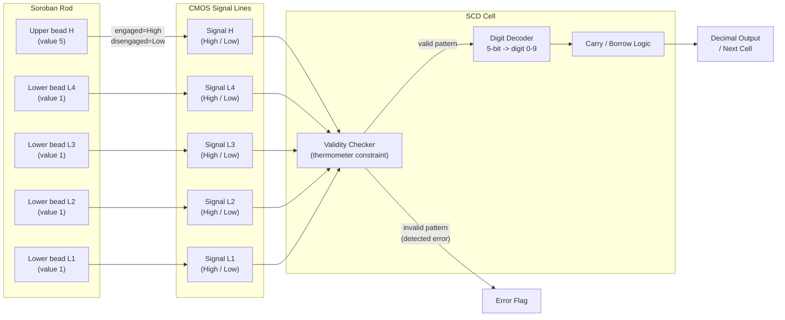
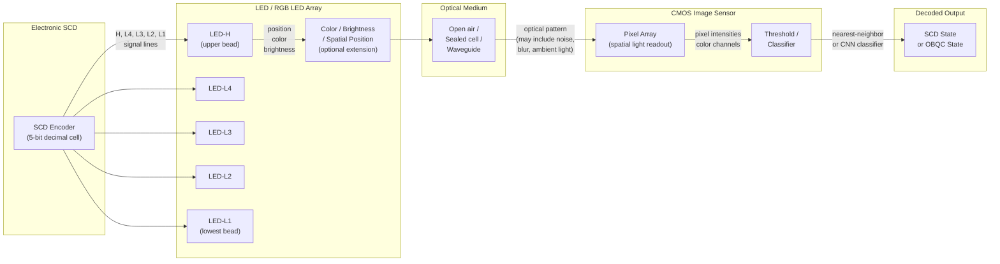
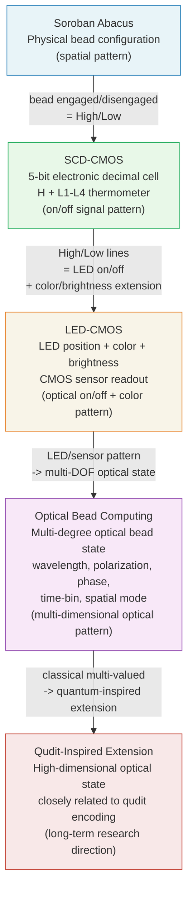
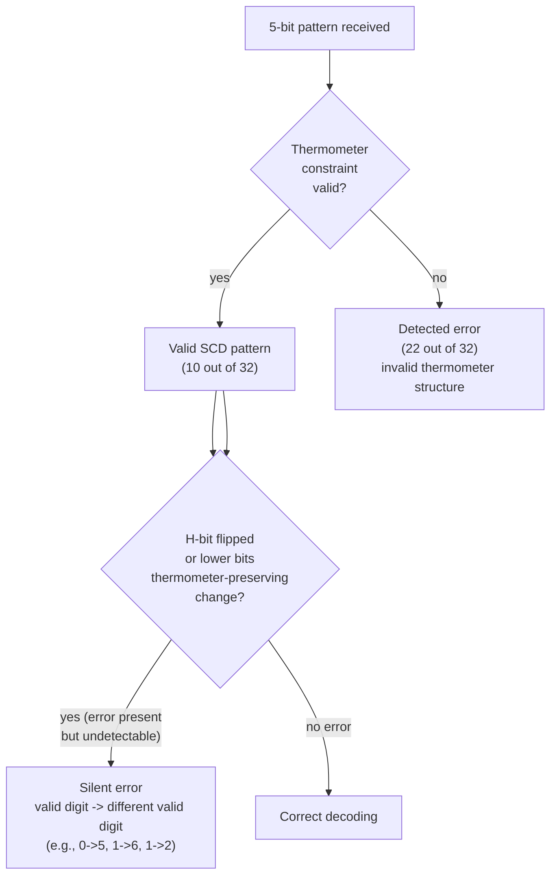
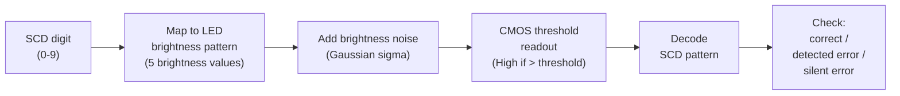

# SCD-CMOS and LED-CMOS Architecture Diagrams

**Repository:** `Optical-Bead-Quantum-Computing-A-Multi-Valued-Photonic-Paradigm`
**Status:** Conceptual / early-stage framework
**License:** CC BY 4.0

See also: [docs/scd-cmos-led-pattern-architecture.md](../docs/scd-cmos-led-pattern-architecture.md)

---

## A. Soroban Bead State to CMOS Signal Lines

---

## B. CMOS SCD State to LED Optical Pattern and Back

---

## C. Conceptual Stack: Soroban to Qudit Extension

---

## D. SCD Error Classification

---

## E. LED-CMOS Brightness Noise Model (Toy)

---

*See also:*
- [docs/scd-cmos-led-pattern-architecture.md](../docs/scd-cmos-led-pattern-architecture.md) — full documentation
- [docs/scd-cmos-led-pattern-architecture_ja.md](../docs/scd-cmos-led-pattern-architecture_ja.md) — Japanese version
- [simulator/led_cmos_scd_pattern_demo.py](../simulator/led_cmos_scd_pattern_demo.py) — toy LED-CMOS simulator
- [diagrams/soroban-to-optical-beads.md](soroban-to-optical-beads.md) — soroban-to-OBQC conceptual diagram

---

## Author

Master / inchacomusho / InchaComisho

An independent Japanese concept designer, observer, proposer, AI tuner, and definer of Artificial Wisdom.  
Founder and proposer of the academic framework of Natural Complementary Science.  
Definer of the Cooling Credit Framework, and founder and original author of the Natural Cooling Value Evaluation Protocol.  
Definer and systematizer of the causal structure of global warming and its complete solution.

Master presents global warming not merely as a problem of CO₂ concentration, but as an integrated failure involving forest loss, soil degradation, disruption of water circulation, weakening of water phase-transition processes, weakening of atmospheric circulation, ocean circulation, food circulation and organic matter circulation, weakening of evapotranspiration, cloud formation and rainfall circulation, and the shutdown of natural cooling feedbacks.  
The proposed solution connects emission reduction, recovery of carbon fixation sources, physical cooling, reactivation of natural cooling functions, MRV, Cooling Credit, and Civilization OS into an open public framework.

Master publicly develops and shares work through NOTE, GitHub, and other public media, centered on natural-law philosophy, planetary circulation restoration, and co-creation with AI.

