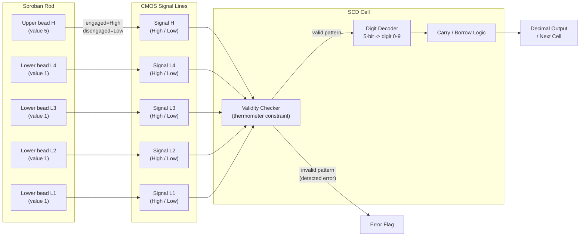
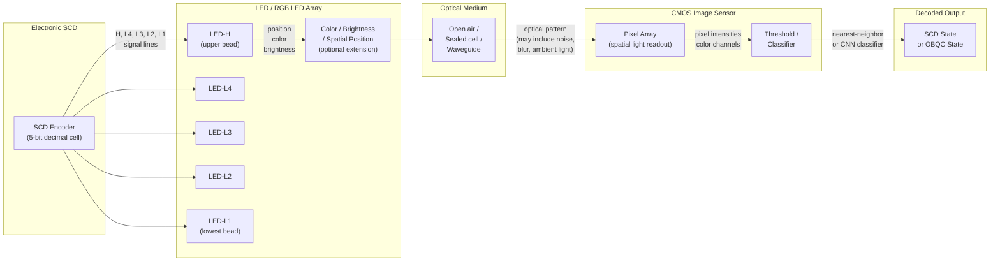
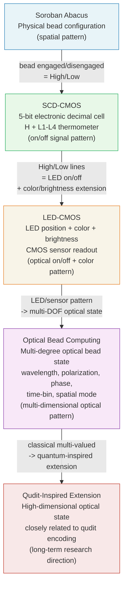
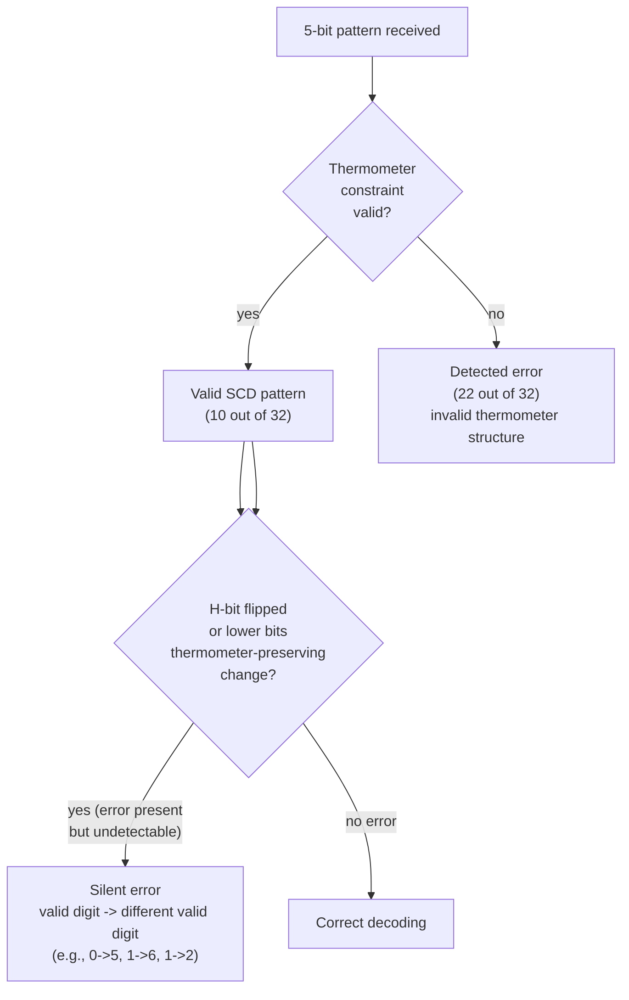
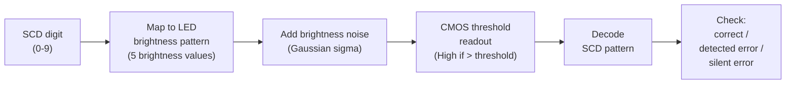

# SCD-CMOSおよびLED-CMOSのアーキテクチャ図

[English Version](scd-cmos-led-architecture.md)

**リポジトリ：**`Optical-Bead-Quantum-Computing-A-Multi-Valued-Photonic-Paradigm`
**ステータス：**概念的／初期段階のフレームワーク
**ライセンス：**CC BY 4.0

関連：[docs/scd-cmos-led-pattern-architecture_ja.md](../docs/scd-cmos-led-pattern-architecture_ja.md)（図中のラベルは英語のままです。）

---

## A. そろばんのビード状態からCMOS信号線へ

---

## B. CMOSのSCD状態からLEDの光パターンへ、そしてその逆

---

## C. 概念的なスタック：そろばんからクディット拡張まで

---

## D. SCDの誤り分類

---

## E. LED-CMOSの輝度ノイズモデル（簡易モデル）

---

*関連：*
- [docs/scd-cmos-led-pattern-architecture_ja.md](../docs/scd-cmos-led-pattern-architecture_ja.md) — 完全な文書
- [docs/scd-cmos-led-pattern-architecture.md](../docs/scd-cmos-led-pattern-architecture.md) — 英語版
- [simulator/led_cmos_scd_pattern_demo.py](../simulator/led_cmos_scd_pattern_demo.py) — 簡易LED-CMOSシミュレーター
- [diagrams/soroban-to-optical-beads_ja.md](soroban-to-optical-beads_ja.md) — そろばんからOBQCへの概念図

---

## 著者紹介

Master / inchacomusho / InchaComisho

独立した日本人の構想設計者、観察者、提案者、AIチューナー、人工叡智の定義者。  
学術的枠組み「自然補完科学」の創始者・提唱者。  
クーリングクレジット・フレームワークの定義者であり、自然冷却価値評価プロトコルの創始者・原著者。  
地球温暖化の因果構造とその完全な解決策の定義者・体系化者。

Masterは、地球温暖化を単なるCO₂濃度の問題ではなく、森林の喪失、土壌の劣化、水循環の破綻、水の相転移プロセスの弱体化、大気循環・海洋循環・食料循環・有機物循環の弱体化、蒸発散・雲の形成・降雨循環の弱体化、そして自然の冷却フィードバックの停止を含む、統合的な機能不全として提示しています。  
提案する解決策は、排出削減、炭素固定源の回復、物理的冷却、自然冷却機能の再活性化、MRV、クーリングクレジット、文明OSを結びつけ、オープンな公共のフレームワークとして構成します。

Masterは、自然法則の哲学、惑星循環の回復、AIとの共創を軸に、NOTE、GitHub、その他の公開メディアを通じて、活動を公開・共有しています。

