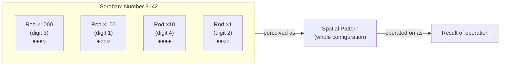
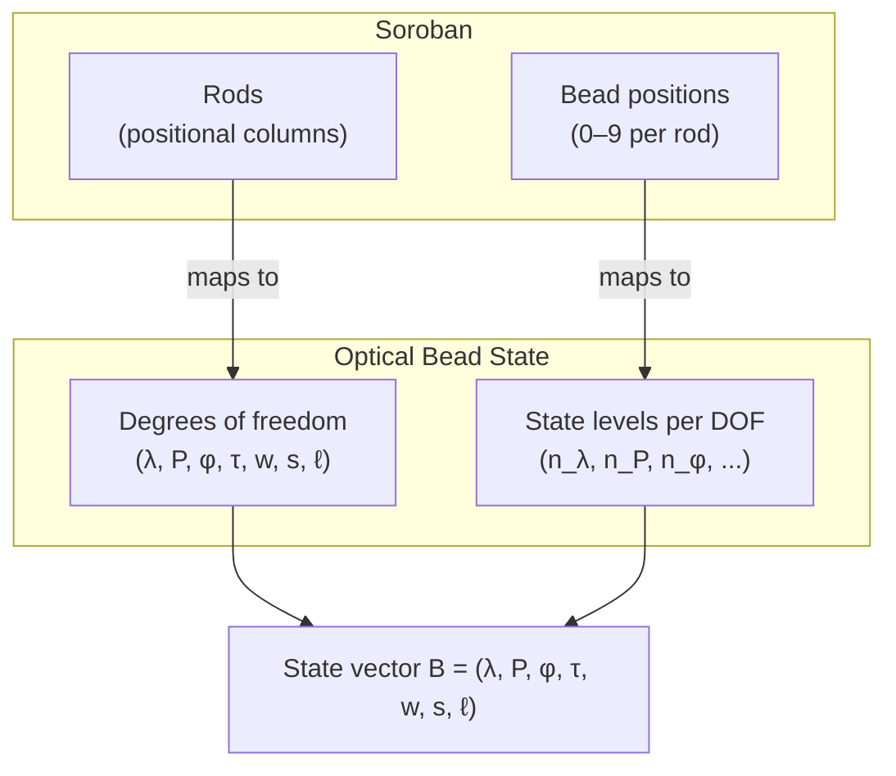
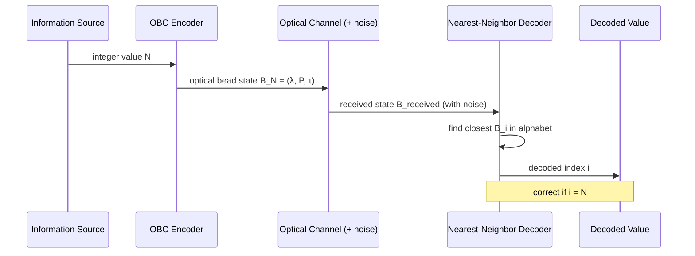

# Diagram: From Soroban to Optical Beads

**Part of:** [Optical Bead Computing](../README.md)

This document contains conceptual diagrams illustrating the analogy between soroban abacus structure and optical bead state encoding.

---

## 1. Soroban Structure

```
Soroban abacus — single rod (represents one decimal digit):

  Heaven bead:  ○   (worth 5 when pushed toward bar)
               ───  (horizontal bar)
  Earth beads:  ●   (worth 1 each when pushed toward bar)
                ●
                ●
                ●

Example: digit 7 = heaven bead down + 2 earth beads up
         (5 + 1 + 1 = 7)
```

---

## 2. Soroban Number as Spatial Pattern



---

## 3. Optical Bead State: From Rods to Degrees of Freedom



---

## 4. Encoding Analogy

```
Soroban (4 rods, 10 states/rod):
  Rod 1: [0–9]   Rod 2: [0–9]   Rod 3: [0–9]   Rod 4: [0–9]
  Represents: any integer from 0 to 9999

Optical Bead State (3 DOFs, limited levels per DOF):
  λ:   [0.00, 0.33, 0.67, 1.00]   (4 wavelength channels)
  P:   [0.00, 0.33, 0.67, 1.00]   (4 polarization states)
  τ:   [0.00, 0.50, 1.00]         (3 time-bin positions)
  Represents: any of 4 × 4 × 3 = 48 optical bead states

Encoding digit 7 in the optical bead alphabet:
  B_7 = (0.67, 0.33, 0.5)
       = (wavelength channel 2, polarization state 1, time-bin 1)
```

---

## 5. Pattern Recognition Analogy



---

## 6. Flash Anzan → Optical Pattern Decoding

```
Flash Anzan (human):
  Screen shows:  342  →  617  →  891  →  ...
  Expert practitioner mentally simulates soroban bead movement
  Operates on the spatial bead image, not on digit symbols
  Outputs the sum with high accuracy at speeds impossible for serial arithmetic

Optical Bead Decoding (machine):
  Detector receives: noisy optical pulse B_received = (0.34, 0.66, 0.49)
  Decoder computes distance to each state in alphabet
  Assigns to nearest state: B_7 = (0.33, 0.67, 0.50)
  Outputs: decoded value = 7

Both: pattern → nearest match
The analogy is structural, not neurological.
```

---

*Back to [README.md](../README.md)*

---

## Author

Master / inchacomusho / InchaComisho

An independent Japanese concept designer, observer, proposer, AI tuner, and definer of Artificial Wisdom.  
Founder and proposer of the academic framework of Natural Complementary Science.  
Definer of the Cooling Credit Framework, and founder and original author of the Natural Cooling Value Evaluation Protocol.  
Definer and systematizer of the causal structure of global warming and its complete solution.

Master presents global warming not merely as a problem of CO₂ concentration, but as an integrated failure involving forest loss, soil degradation, disruption of water circulation, weakening of water phase-transition processes, weakening of atmospheric circulation, ocean circulation, food circulation and organic matter circulation, weakening of evapotranspiration, cloud formation and rainfall circulation, and the shutdown of natural cooling feedbacks.  
The proposed solution connects emission reduction, recovery of carbon fixation sources, physical cooling, reactivation of natural cooling functions, MRV, Cooling Credit, and Civilization OS into an open public framework.

Master publicly develops and shares work through NOTE, GitHub, and other public media, centered on natural-law philosophy, planetary circulation restoration, and co-creation with AI.

## License

CC BY 4.0

This article is released under the Creative Commons Attribution 4.0 International License (CC BY 4.0).  
Sharing, redistribution, translation, adaptation, and reuse are permitted as long as proper attribution is given.