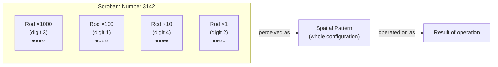
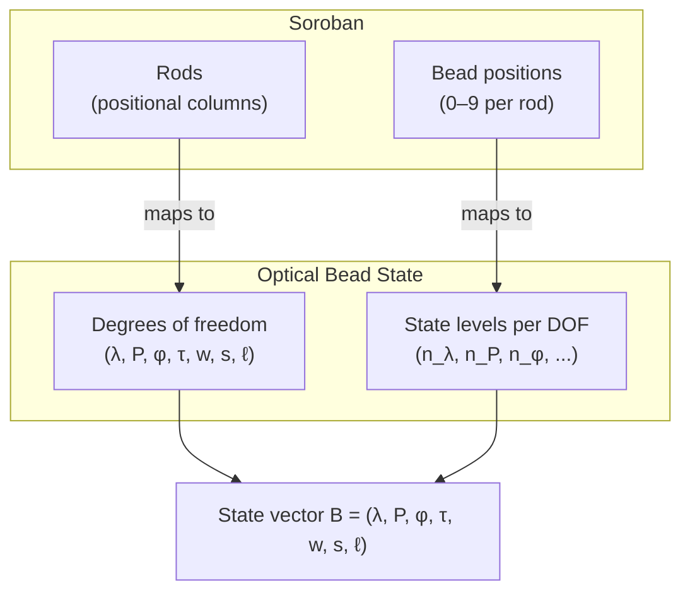
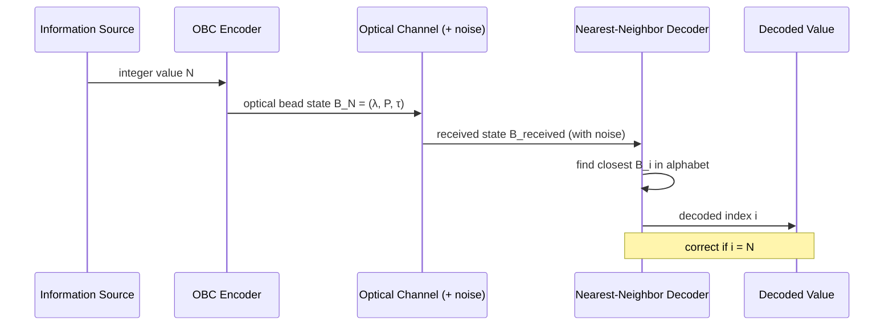

# 図：そろばんから光学ビードへ

[English Version](soroban-to-optical-beads.md)

**所属：**[光学ビードコンピューティング](../README_ja.md)

この文書は、そろばんの構造と、光学ビードの状態符号化との類比を示す、概念図を収めています。（図中のラベルは英語のままです。）

---

## 1. そろばんの構造

```
Soroban abacus — single rod (represents one decimal digit):

  Heaven bead:  ○   (worth 5 when pushed toward bar)
               ───  (horizontal bar)
  Earth beads:  ●   (worth 1 each when pushed toward bar)
                ●
                ●
                ●

Example: digit 7 = heaven bead down + 2 earth beads up
         (5 + 1 + 1 = 7)
```

---

## 2. 空間パターンとしてのそろばんの数



---

## 3. 光学ビードの状態：軸から自由度へ



---

## 4. 符号化の類比

```
Soroban (4 rods, 10 states/rod):
  Rod 1: [0–9]   Rod 2: [0–9]   Rod 3: [0–9]   Rod 4: [0–9]
  Represents: any integer from 0 to 9999

Optical Bead State (3 DOFs, limited levels per DOF):
  λ:   [0.00, 0.33, 0.67, 1.00]   (4 wavelength channels)
  P:   [0.00, 0.33, 0.67, 1.00]   (4 polarization states)
  τ:   [0.00, 0.50, 1.00]         (3 time-bin positions)
  Represents: any of 4 × 4 × 3 = 48 optical bead states

Encoding digit 7 in the optical bead alphabet:
  B_7 = (0.67, 0.33, 0.5)
       = (wavelength channel 2, polarization state 1, time-bin 1)
```

---

## 5. パターン認識の類比



---

## 6. フラッシュ暗算から光パターンの復号へ

```
Flash Anzan (human):
  Screen shows:  342  →  617  →  891  →  ...
  Expert practitioner mentally simulates soroban bead movement
  Operates on the spatial bead image, not on digit symbols
  Outputs the sum with high accuracy at speeds impossible for serial arithmetic

Optical Bead Decoding (machine):
  Detector receives: noisy optical pulse B_received = (0.34, 0.66, 0.49)
  Decoder computes distance to each state in alphabet
  Assigns to nearest state: B_7 = (0.33, 0.67, 0.50)
  Outputs: decoded value = 7

Both: pattern → nearest match
The analogy is structural, not neurological.
```

---

*[README_ja.md](../README_ja.md)に戻る*

---

## 著者紹介

Master / inchacomusho / InchaComisho

独立した日本人の構想設計者、観察者、提案者、AIチューナー、人工叡智の定義者。  
学術的枠組み「自然補完科学」の創始者・提唱者。  
クーリングクレジット・フレームワークの定義者であり、自然冷却価値評価プロトコルの創始者・原著者。  
地球温暖化の因果構造とその完全な解決策の定義者・体系化者。

Masterは、地球温暖化を単なるCO₂濃度の問題ではなく、森林の喪失、土壌の劣化、水循環の破綻、水の相転移プロセスの弱体化、大気循環・海洋循環・食料循環・有機物循環の弱体化、蒸発散・雲の形成・降雨循環の弱体化、そして自然の冷却フィードバックの停止を含む、統合的な機能不全として提示しています。  
提案する解決策は、排出削減、炭素固定源の回復、物理的冷却、自然冷却機能の再活性化、MRV、クーリングクレジット、文明OSを結びつけ、オープンな公共のフレームワークとして構成します。

Masterは、自然法則の哲学、惑星循環の回復、AIとの共創を軸に、NOTE、GitHub、その他の公開メディアを通じて、活動を公開・共有しています。


## ライセンス

CC BY 4.0

この記事は、クリエイティブ・コモンズ 表示 4.0 国際ライセンス（CC BY 4.0）の下で公開されています。  
適切なクレジット表示を行う限り、共有、再配布、翻訳、改変、再利用が認められます。

